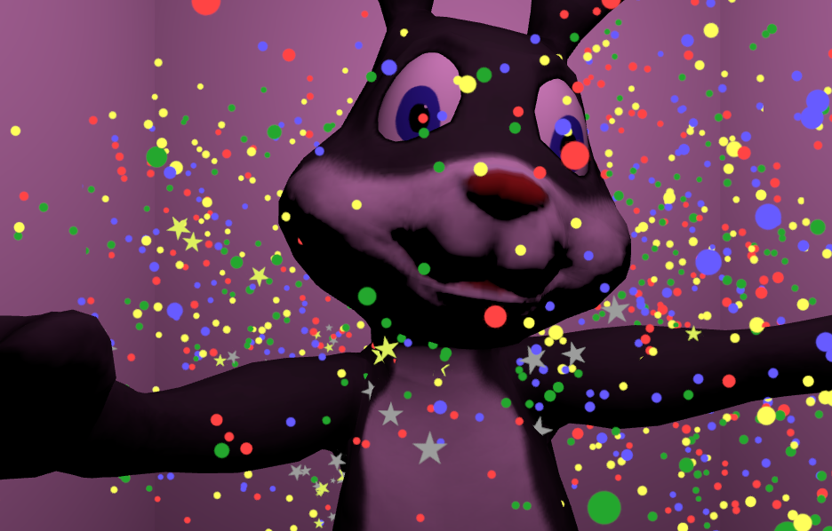

# Down the Rabbit Hole VR

A VR experience about experiencing VR in VR. For PC + HTC Vive, created in 36 hours at the September 2016 Seattle VR Hackathon.

Controls:
----------------
* Pick up objects using the trigger on either Vive controller.  
* Grab VR headsets and pull them towards your eyes to put them on and go one layer deeper.  
* Bring the ring/donut of either Vive controller towards your eyes and pull away to remove a headset and go one layer higher.  

Awards:
----------------
* First Place, Best Visual Design
* Second Place, Community Choice Category

Credits:
----------------
#### Dev Team:  
  Joey Koblitz,  
  Anindya Dey,  
  Masashi Schafer,  
  Jeff Atwood,  
  Jim Irving,  
  Hunter Irving,  
  David Lee  
  
#### With guest appearances by:  
  Jake from PAX
  
#### Musical performances by:  
  Nujabes,  
  Erik Satie,  
  Sergei Mantis,  
  And Others  
  
#### Some assets provided by:  
  The Unity Asset Store

If you're looking for a compiled executable of the game:
----------------
  *[Look no futher.](https://drive.google.com/file/d/0B1fOxfGxRccTQXdMSWl3MmE2ckU/view?usp=sharing)*
 
See Also: An Exclusive DEVELOPER COMMENTARY VIDEO
----------------

